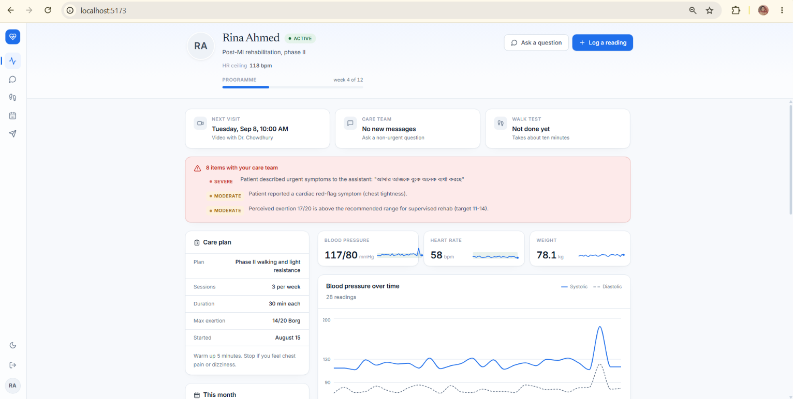
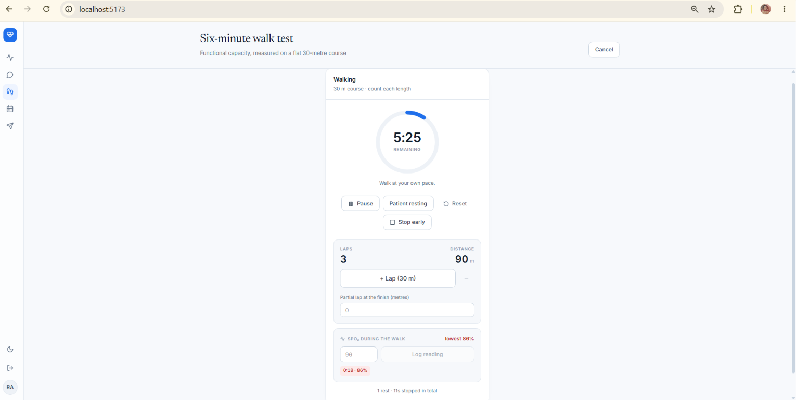
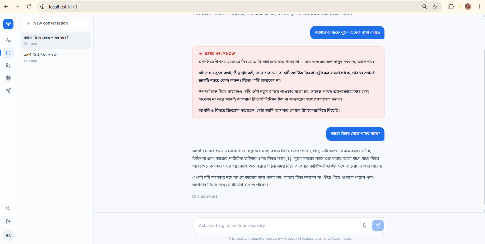
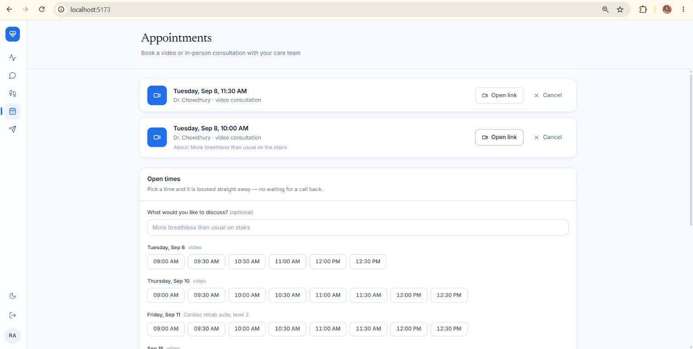
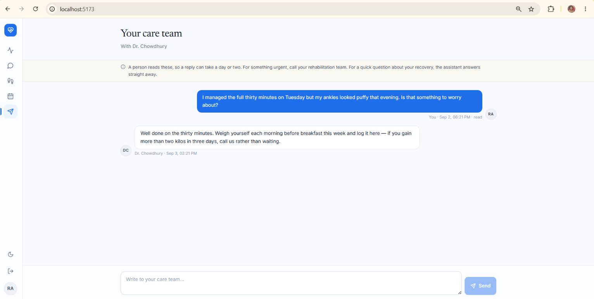
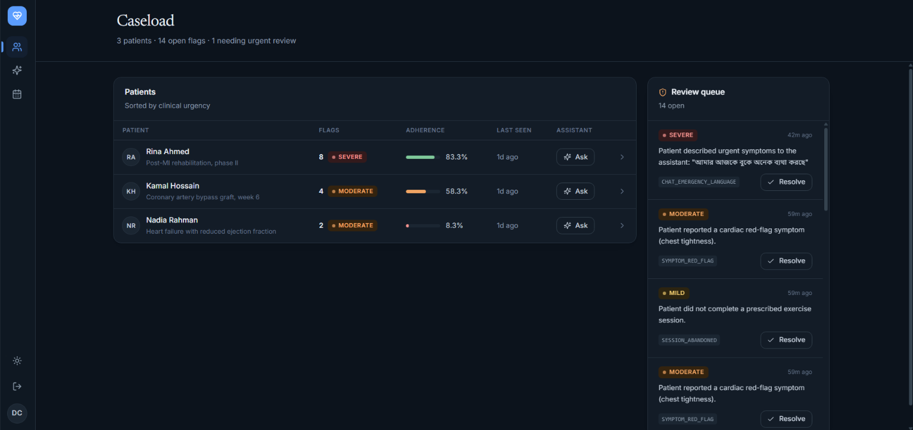
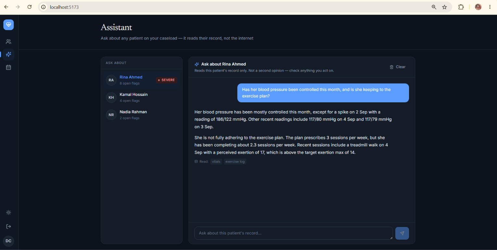
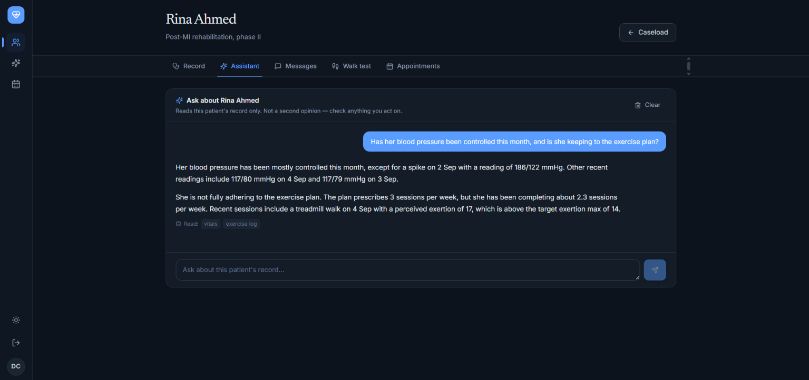
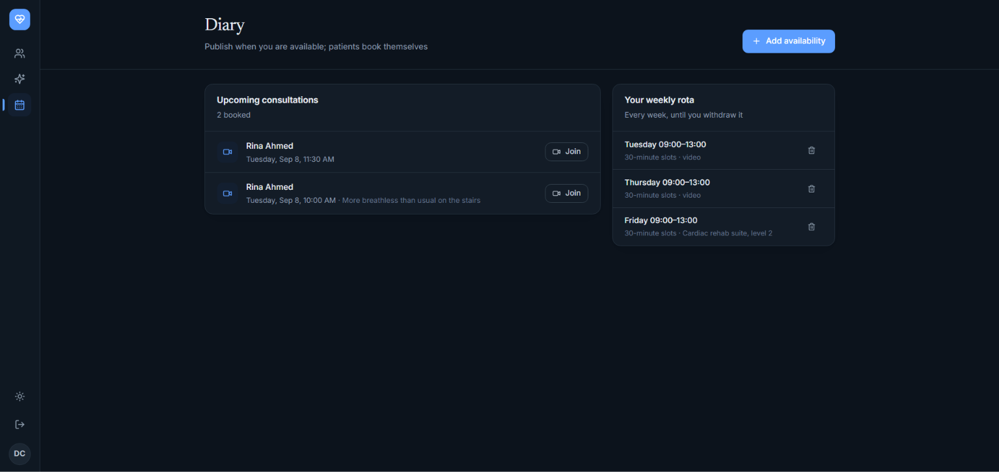

# Cardiac Rehab Platform

A remote cardiac rehabilitation service. Patients log vital signs, symptoms and
exercise sessions, record six-minute walk tests, book video or in-person
consultations from their clinician's rota, and message their care team; a rule
engine evaluates every submission and raises flags for clinician review;
clinicians work a caseload prioritised by clinical urgency, run a diary, and
question an assistant that reads one patient's record.

Built as a single-developer project: FastAPI + PostgreSQL on the back end,
React + TypeScript on the front, with an emphasis on the parts that are usually
skipped — authorisation boundaries, pagination that does not lose rows,
reversible migrations, and tests that assert the boundaries hold.

> **Not a medical device.** The thresholds in the risk engine are illustrative
> and this system has not been clinically validated.


---

*Patient screens in light, clinician screens in dark — the interface ships with
both, and severity colours are tuned separately for each ground rather than
inverted.*

### The patient

**What is next, what was flagged, and the trend behind it.** The severe flag at
the top was raised by the assistant itself, from a message written in Bangla.
The chart below shows the hypertensive crisis that raised the one under it.



**The six-minute walk test, mid-walk.** The clock keeps running through a rest,
as the protocol requires. Rests and the oxygen nadir are captured by the timer —
"lowest 86%" turns red the moment it is logged — rather than recalled afterwards
and typed into a form.



**Bangla in, Bangla out, English corpus.** Above, a question about chest pain is
caught before retrieval runs and answered with escalation advice, not guidance —
and the patient is told her care team has been informed, which is true: it
raises a severe flag. Below it, an ordinary question is answered from English
source passages, in Bangla, with the citation marker intact.



**Booking, with no waiting for a call back.** The 10:00 slot is missing from
Tuesday's row because it is already taken; slots are generated from the rota on
read and a unique constraint stops two patients taking one.



**Messaging**, deliberately separate from the assistant: a patient must never be
unsure whether they are writing to a person or to software.



### The clinician

**The caseload**, ordered by clinical urgency, beside a queue of flags raised
automatically from patient data — including the Bangla one, quoted verbatim.



**The assistant**, answering from one patient's record. The chips under each
answer say which parts of the record it actually read, and it reads only the
ones it needs.



**One patient, five tabs** — record, assistant, messages, walk tests and
appointments in one place.



**The diary.** A weekly rota published once, rather than individual slots
written out and maintained by hand.



---

## Quick start

### With Docker (Postgres, migrations, both apps)

```bash
docker compose up --build
```

- App — <http://localhost:8080>
- API docs — <http://localhost:8000/docs>

### Locally, without Docker

```bash
# --- backend ---
cd backend
python -m venv .venv && source .venv/bin/activate   # Windows: .venv\Scripts\activate
pip install -r requirements-dev.txt
cp .env.example .env                                 # then set JWT_SECRET_KEY
python -c "import secrets; print(secrets.token_urlsafe(48))"   # generate one

alembic upgrade head            # create the schema
python -m scripts.embed_corpus  # REQUIRED: chunk and embed the guidance corpus
python -m scripts.seed_demo     # optional: demo accounts and 28 days of history
uvicorn app.main:app --reload

# --- frontend (second terminal) ---
cd frontend
npm install
npm run dev                   # http://localhost:5173, proxies /api to :8000
```

Without `embed_corpus` the assistant has nothing to retrieve and answers every
question with "I don't have guidance on that". It downloads BAAI/bge-m3 on first
run (~2.5 GB); `--backend hash` skips the download and gives deterministic
nonsense embeddings, which is enough to see the plumbing work but not the
answers.

The schema and the corpus are separate concerns: dropping the database drops the
corpus with it, and only this script puts it back.

### Demo accounts

Seeded by `scripts/seed_demo.py`. All use the password `demo-password-123`.

| Account | Role | What you see |
|---|---|---|
| `dr.chowdhury@example.com` | clinician | Caseload of 3 patients, live flag queue |
| `rina@example.com` | patient | 28 days of readings, 92% adherence |
| `kamal@example.com` | patient | Moderate adherence, a heart-rate flag |
| `nadia@example.com` | patient | Poor adherence — how the dashboard surfaces drop-off |
| `admin@example.com` | admin | Everything, plus patient assignment |

The seed is deterministic and idempotent: re-running it will not duplicate data.

---

## What's interesting here

Six things that took real thought. Each links to the detail.

**A rule engine, not a diagnosis.** Every reading a patient submits is evaluated
against thresholds with a cited source, and anything concerning becomes a flag in
a clinician's queue. The system never tells a patient how serious something is —
it decides whether a human should look. → [clinical logic](docs/clinical.md)

**A six-minute walk test that stops asking.** Fifteen typed numbers reduced to
three: a reading under 90 minutes old pre-fills the screening and carries into
the baseline, and the timer captures rests and the oxygen nadir while the walk is
happening rather than asking anyone to recall them afterwards. A reading older
than that is shown but *not* pre-filled — a resting heart rate from yesterday
must not clear a patient with one tap.
→ [clinical logic](docs/clinical.md#the-six-minute-walk-test)

**Self-service booking with real video.** Clinicians publish a weekly rota;
slots are generated on read, not stored. Double-booking is prevented by a unique
constraint on a slot key that is cleared on cancellation, because two patients
can post the same slot in the same millisecond. Rooms are named from `secrets`,
never from patient data — anyone who can guess a room name can walk into the
consultation. → [scheduling](docs/clinical.md#scheduling-and-video-consultations)

**A clinician's assistant that cannot reach the wrong record.** Tool-calling over
one patient's data, where **no tool accepts a patient identifier**. The model
chooses which lookup and over what dates; it never chooses whose record. A
prompt-injected instruction sitting in a symptom note has nothing to call, and a
test fails if anyone ever adds such a parameter.
→ [the two assistants](docs/assistants.md)

**Cross-lingual retrieval, measured rather than assumed.** Bengali questions
against an English corpus, with the relevance threshold set from measured
similarity scores — relevant queries 0.500–0.694, nonsense queries never above
0.480. The reranker is implemented and **switched off**, with the elimination
table for why. → [retrieval](docs/assistants.md#reranking-implemented-and-switched-off)

**Correctness in the type, not at each call site.** `DateTime(timezone=True)` is a
promise SQLite does not keep, so timestamps reached the browser with no offset and
were parsed as local time — a consultation stored at 04:00 UTC displayed at 04:00
in Dhaka and 05:00 in London. Fixed in the column type so no future model can
reintroduce it. → [design decisions](docs/decisions.md)

---

## Architecture

FastAPI + async SQLAlchemy 2.0 + Alembic on Postgres (SQLite in development),
React 18 + TypeScript + Vite + Tailwind 4 on the front, Docker Compose for both.

```
backend/app/
  api/v1/    routes, one module per resource; authorisation lives in the signature
  services/  the logic worth testing on its own — risk rules, scheduling,
             retrieval, the walk-test equations
  models/    SQLAlchemy models      schemas/  Pydantic request and response types
frontend/src/
  pages/     one file per screen    components/  shared presentational pieces
  lib/       typed API client with token refresh
```

Full reference: [API and authorisation](docs/api.md) ·
[repository layout](docs/decisions.md#repository-layout)

---

## Testing

```bash
cd backend && pytest
# 349 passed, 1 xfailed in ~116s
```

Each test runs against a fresh in-memory SQLite database on a shared connection,
so the suite needs no database server and tests cannot leak state into one
another. An autouse fixture clears the API key, so no test can make a billable
call. CI additionally checks that migrations apply, match the models, and
downgrade to base cleanly.

Worth stating plainly: all 347 passed while four real defects sat in the
application — a timezone offset, an input accepting out-of-range values, a
counter frozen at zero mid-rest, and a table overflowing its container. Tests
assert behaviour, not what a screen looks like. Both kinds of checking matter.

---

## Known limitations

Stated plainly, because a repository that claims everything works is not
believable.

- The Bengali emergency phrasings in `services/guardrails.py` are marked
  `PENDING NATIVE-SPEAKER REVIEW`. They pass twelve constructed cases; no
  Bangla-speaking clinician has read them, which is what they need before anyone
  relies on them. This is the most important item on the list.
- Cross-encoder reranking is implemented but **disabled** — its scoring behaviour
  on this machine was never explained. The elimination table is in
  [the retrieval notes](docs/assistants.md#reranking-implemented-and-switched-off).
- The dense-similarity threshold rests on a 12-query calibration set: enough to
  set a defensible number, not enough to call it validated.
- The corpus answers cardiac rehabilitation questions and nothing else, by design.
- Refresh tokens are stateless and cannot be revoked before expiry; a denylist is
  the usual next step. There is no rate limiting on the auth endpoints.
- Zoom and Google Meet are recognised but need per-clinic OAuth to create
  meetings. Jitsi is the working provider.
- Avatars are served by capability URL rather than a signed, expiring one.

---

## Documentation

| | |
|---|---|
| [API and authorisation](docs/api.md) | Every endpoint, and who may call it |
| [Clinical logic](docs/clinical.md) | Risk rules, the walk test, scheduling |
| [The two assistants](docs/assistants.md) | Retrieval, safety, the reranking investigation |
| [Design decisions](docs/decisions.md) | Choices that are not obvious from the code |

## Licence

MIT — see [LICENSE](LICENSE).
